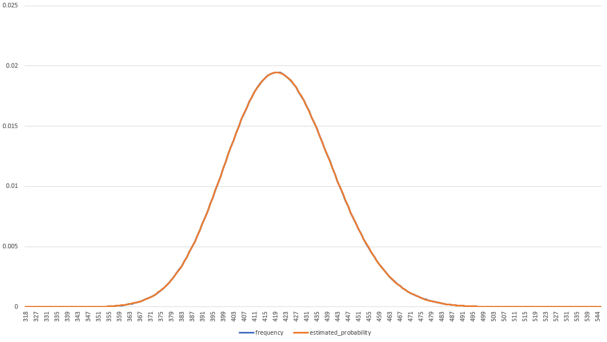
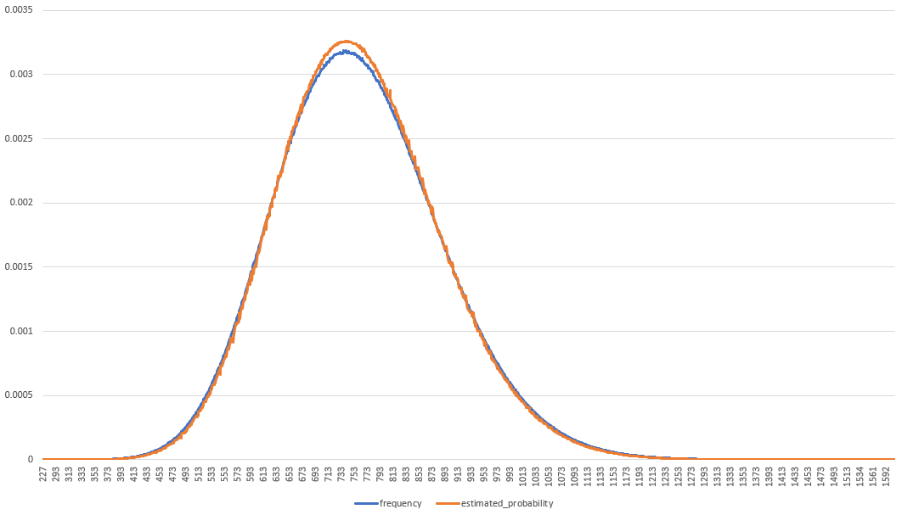

# Minecraft Speed run Simulator Library

This library offers some basic tools for simulating the elements of Minecraft speed runs.  
Specifically, Java edition 1.16.1 blaze fights and piglin barters.

The goal of this library is to help investigate the statistics of blaze fights and piglin barters  
with respect to Dream's cheated 1.16.1 runs.

For more information, please [read the paper](https://mcspeedrun.com/dream.pdf).

I am not part of the Minecraft mod team, and they have not asked for, reviewed, or signed off on this code.  
I have written this specifically out of my own interest and desire to verify or rebut their report.  
I came at this with no expectation of the result, however, you can tell by the language above what my findings were.

## Obtaining the Library

You can use `cargo-edit` to add the library from crates.io:

```PowerShell
cargo add mc_sim
```

## Running the Examples

I recommend cloning this repo and running the examples to see the results for yourself.

```PowerShell
# This example creates a CSV file that has both simulated blaze rod drops, as well as
# the expected blaze rod distribution so that they can be compared.
cargo run --release --example blaze_rod_distribution

# This example creates a CSV file that has both simulated barters, as well as
# the expected ender pearl distribution so that they can be compared.
cargo run --release --example ender_pearl_distribution

# -t can be used to set the thread count.
# -c can be used to set the target number of cycles.
# E.G: 32 threads for 1,000,000,000 cycles.
cargo run --release --example blaze_rod_distribution -- -t 32 -c 1000000000

# You can also pass --help for a print out of options.
cargo run --release --example simulate_streams_til_dreams -- --help

# This example attempts to simulate runs until you get as lucky as dream.
#
# This is not the fastest simulator, because it's designed for answering
# questions on statistics, modelling, and accuracy. There are faster simulators
# out there that take advantage of GPGPU to get tens of millions of simulations
# per second.
#
# However, Dream's cheating means that the luck you are going after is unachievable
# anyway, so this is not expected to terminate in a reasonable period of time.
# Good luck!
cargo run --release --example simulate_streams_til_dreams
```

## Methodology

The simulation in this library is based on the decompiled Minecraft code, using MCP Reborn.  
I decompiled the code myself and came up with my own implementation, that is independent of  
any other previous analysis. Drops are all uniform random with exactly the same odds as in Minecraft.

The distributions in this library are based on my best understanding of the statistics involved.  
I am not a statistician and I don't have a relevant education. However, the paper provided a good  
basis for creating these and the Minecraft speed running Discord has been very helpful in answering  
my stats questions.

The purpose of these distributions is to compare how our expectations and modeling of minecraft stats  
lines up with the simulated results. They are also used to quantify how lucky a run is during simulation.

### Blaze Rod Distribution



> 100,000,000 samples, showing how the model and the simulator produce very similar results.  
> In blue are the samples from the simulator, in orange is the statistical model.

`BlazeRodDistribution` uses a negative binomial that works over successful blaze fights out of total fights.  
Specifically: `n = Tr` -- `p = 1 / 2`

Where:

* `n` is the number of successes expected by the negative binomial distribution.
* `p` is the probability of a successful fight (a fight that drops a blaze rod).
* `Tr` is the target number of blaze rods that are required for all the runs in the simulation.
* `1 / 2` is the odds of a blaze dropping a blaze rod.

This distribution works with any configuration of target rods per run in the simulation with no appreciable  
difference to large amounts of sampled data. This distribution produces exactly the same result as the  
distribution used in the paper when fed the data from Dream's runs.

### Ender Pearl Distribution



> 100,000,000 samples, showing how the model and the simulator produce very similar results.  
> In blue are the samples from the simulator, in orange is the statistical model.

`EnderPearlDistribution` uses a negative binomial that works over successful barters out of the total barters.  
Specifically: `n = Tp / Rp * Mp` -- `p = 20 / 423`

Where:

* `n` is the number of successes expected by the negative binomial distribution.
* `p` is the probability of a successful barter (a barter that drops pearls).
* `Tp` is the total number of pearls required within the simulation that the distribution is being used for.
* `Rp` is the number of pearls required per run within the simulation.
* `Mp` is the average number of barters required to get to `Rp`.  
  This is actually computed by using the answer to a stack exchange question that I raised while  
  working on this library: [https://math.stackexchange.com/a/3965269/867664](https://math.stackexchange.com/a/3965269/867664)  
* `20 / 423` is the odds of a barter dropping ender pearls in 1.16.1, verified from the minecraft jar data.

The ender pearl distribution only works in the case where each run has the same target. This means that  
it does not align well when you ask it to model simulations of runs with different target pearl counts.  
This limitation means that the ender pearl distribution used does not produce the same result as the paper.

The paper worked over successful barters out of total barters, which is considerably easier to model.  
Ultimately, I haven't done any better here. Indeed, this is a much less precise model for answering the  
question of "how lucky did Dream get?"

This model is considerably more Dream favoured for two reasons:

1. I must discard all but 17 of the runs, where over 10 pearls were obtained.  
   This allows me to set the target for all runs in the simulation to 10 pearls.  
   The data discarded still had pearl drops, which were on the luckier side of this distribution.
2. Because I only check that the target of 10 (or more) has been reached,  
   Runs such as the run that had 26 pearls dropped are heavily improving Dream's odds in this  
   analysis. Ideally, I would record all the drops in Dream's runs and only count barters up  
   until 10 pearls was reached, however, this is impractical to do given only the VoDs.

## Findings

1. The rebuttal paper suggested that, because runs stop bartering and fighting blazes when they  
   reach a target number of ender pearls and blaze rods, there is an extra 'stopping rule' there  
   that makes a binomial distribution inappropriate for modeling this problem.  
   **This is found to be untrue as the model aligns with the simulated data.**
2. The blaze rod odds given by the paper are fully supported by both the simulation and statistics  
   presented in this library. The statistical distribution and simulation line up excellently, and  
   the distribution provides the same result for Dream's luck as in the paper.  
3. It takes on average 2.12 barters that drop ender pearls, to get to the required 10 for a run.

Odds of Dream's blaze luck as per this model: `8.791412042796765e-12`  
Odds of Dream's ender pearl luck as per this model: `6.713608557973316e-10`

## License

This library is provided under the [wtfpl](http://www.wtfpl.net/about/), or MIT, or [Apache 2.0](https://www.apache.org/licenses/LICENSE-2.0).  
Take your pick, see: LICENSE-WTFPL, LICENSE-MIT, and LICENSE-APACHE.
